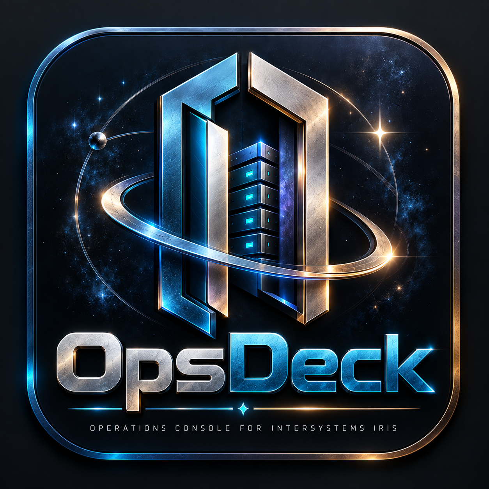

# OpsDeck

<p align="center">
  <a href="https://kennethjsmithdev.github.io/OpsDeck/"><strong>🚀 LIVE SAFE DEMO</strong></a>
  &nbsp;·&nbsp;
  <a href="#current-release"><strong>📦 RELEASE STATUS</strong></a>
  &nbsp;·&nbsp;
  <a href="#development"><strong>🛠️ DEVELOPMENT</strong></a>
</p>

<p align="center">
  <sub>Interactive sanitized sample data · No IRIS connection or credentials required</sub>
</p>

<p align="center">
  
</p>

**OpsDeck** is an open-source, web-based operations console for InterSystems IRIS. It brings application discovery, access and security metadata, tasks, system information, logs, and evidence-backed read verification into one focused interface.

OpsDeck is being developed for the **InterSystems Programming Contest: Build Your Own Management Portal (2026)**.

## Current release

OpsDeck is currently preparing its **v0.1.0** release against **InterSystems IRIS Community Edition 2026.2**.

The public repository contains the qualified Node-based reference runtime while the IRIS-native `/opsdeck` packaging path is being finalized. The reference runtime talks only to a locally reachable IRIS instance and uses fixed, read-only provider routes. It does not mirror IRIS state into another database.

### Current management workspace

- **Overview** — live IRIS identity, API information, namespaces, application count, and authoritative read-back status.
- **Applications** — web applications, REST-service discovery, application detail, and bounded Swagger/OpenAPI summaries.
- **Access** — users, roles, and resources through explicit read-only provider mappings.
- **Security** — bounded security metadata with explicit field allowlists; secret-bearing values are not intentionally rendered.
- **Tasks** — task inventory and schedule/status information where available from the provider.
- **System** — system usage, processes, databases, and devices where available.
- **Logs** — audit status/event definitions, task history, and journal-file metadata where available.

Provider errors and unavailable sources are shown separately from valid empty collections. OpsDeck does not substitute fixture data for live IRIS state.

## Design

OpsDeck follows a deliberately thin architecture:

```text
User
  ↓
OpsDeck
  ↓
bounded provider adapter
  ↓
authoritative InterSystems IRIS APIs
  ↓
rendered result
  ↓
independent authoritative read-back where qualified
```

IRIS remains the source of truth. OpsDeck keeps provider-owned identities and scopes rather than creating a second operational state store.

## Requirements

For the current reference runtime:

- **InterSystems IRIS Community Edition 2026.2**, available through the local SysAdmin API (the tested default is `http://127.0.0.1:52773`). A native Windows installation is supported; Docker is optional.
- **Node.js 22 or newer**

The application has no npm package dependencies; it uses Node's built-in modules.

**Docker is optional.** OpsDeck can use an existing local IRIS installation. A container may also be used as a development/test IRIS instance, but Docker is not an application requirement.

Use the supported InterSystems Windows installer or an InterSystems-published Community Edition image. The validated container image was `intersystems/iris-community:2026.2-linux-amd64` (Linux/amd64). See the [official image and deployment guidance](https://hub.docker.com/r/intersystems/iris-community) and the [official 2026.2 documentation](https://docs.intersystems.com/irislatest/csp/docbook/DocBook.UI.Page.cls?KEY=ACLOUD).

Keep the Management Portal and API on the local machine for this development workflow; do not expose management ports to an untrusted network.

## Start a local IRIS instance

For a native Windows installation, start the IRIS instance using the installed InterSystems tooling and verify the local Management Portal at `http://127.0.0.1:52773/csp/sys/UtilHome.csp` (adjust the port if the installation uses another one). Complete any required first-login setup in the Portal, then enter the resulting account in OpsDeck. Do not put that password in a command, repository file, or issue.

### Optional: use the Community Edition container

If no container named `opsdeck-iris` exists, run:

```powershell
docker run --name opsdeck-iris --detach `
  --publish 127.0.0.1:1972:1972 `
  --publish 127.0.0.1:52773:52773 `
  intersystems/iris-community:2026.2-linux-amd64
```

Wait for the container health check and verify the Management Portal at `http://127.0.0.1:52773/csp/sys/UtilHome.csp`. Complete the IRIS first-login password setup in the portal. Do not put that password in a command, repository file, or issue. To restart the same container later, use `docker start opsdeck-iris` and verify its health again.

## Run the current reference runtime

Clone the repository, then from its root:

```powershell
npm test
npm start
```

Open:

```text
http://127.0.0.1:4173
```

By default the reference runtime expects IRIS at:

```text
http://127.0.0.1:52773
```

To use a different **loopback** IRIS HTTP port, set `OPSDECK_IRIS_URL` before starting OpsDeck:

```powershell
$env:OPSDECK_IRIS_URL = 'http://127.0.0.1:52773'
npm start
```

The reference proxy intentionally rejects non-loopback IRIS origins.

## Authentication and security

The current reference runtime accepts an IRIS username and password only for the local OpsDeck session.

- Credentials are not written to repository files.
- Credentials are not intentionally persisted in browser storage.
- The local reference server keeps its authorization material only in process memory for the active session and clears it when the session expires or the process stops.
- Only explicitly registered IRIS routes are proxied.
- Arbitrary upstream paths and arbitrary cross-origin targets are rejected.
- Provider mappings use explicit field allowlists for operational views.
- Mutation workflows are outside the v0.1 read-only baseline.

Use an IRIS account with only the privileges needed for the management information you intend to inspect.

## Verification model

The Overview and Applications path includes an independent read-back check for the live web-application list. OpsDeck compares the displayed state with a separate authoritative IRIS read, independent of row order.

The broader v0.1 provider set uses stable provider identities, bounded source registration, explicit safe-field mappings, and visible provider-error handling. Not every provider has the same read-back semantics; the UI does not claim verification where it has not been established.

## Development

The repository is intentionally small:

```text
public/
  index.html
  app.js
  styles.css

src/
  iris-provider.js
  server.mjs

test/
  app-bootstrap.test.mjs
  iris-provider.test.js
  server.test.mjs
```

Run the automated suite with:

```powershell
npm test
```

The Node server is the preserved reference/development runtime. The release target is an IRIS-native application served at `/opsdeck`; native installation and IPM/ZPM packaging instructions will replace the reference-runtime instructions once that path is qualified.

## Project status

### Proven in the reference path

- Live IRIS server identity through the SysAdmin API.
- Live web-application discovery.
- Independent web-application read-back comparison.
- Fixed read-only provider registry for the v0.1 management domains.
- Explicit output allowlists and secret-shaped field rejection in provider mapping.
- Automated adapter/server/bootstrap tests.

### In qualification for v0.1.0

- IRIS-native `/opsdeck` hosting.
- Native authentication/session behavior.
- Native parity across the accepted management domains.
- Reproducible native installation.
- IPM/ZPM packaging.

This section is intentionally conservative: unfinished work is not presented as released functionality.

## Support

Use the repository's **Issues** section for reproducible bugs and support requests. Please do not include passwords, tokens, private keys, or other secrets in issue reports.

## License

OpsDeck is licensed under the [MIT License](LICENSE).
