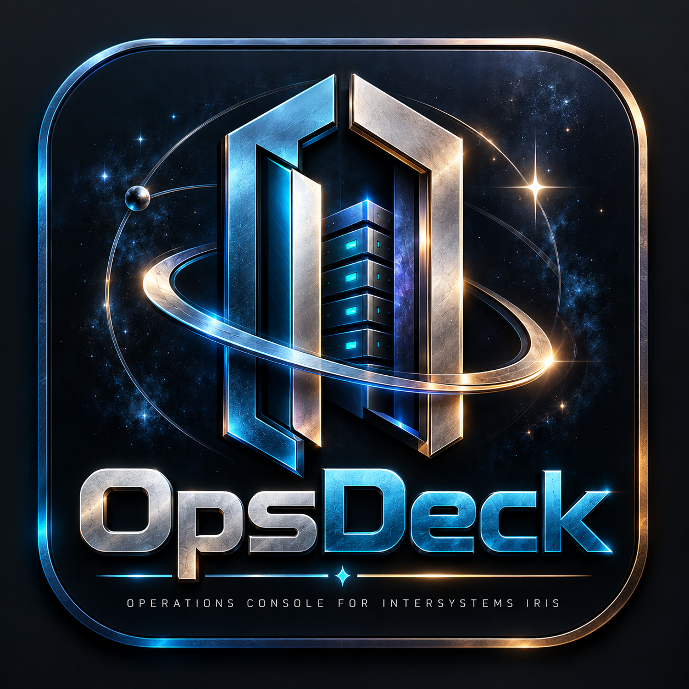

# OpsDeck

<p align="center">
  <a href="https://kennethjsmithdev.github.io/OpsDeck/"><strong>🚀 LIVE SAFE DEMO</strong></a>
  &nbsp;·&nbsp;
  <a href="https://github.com/KennethJSmithDev/OpsDeck/releases/tag/v0.2.0"><strong>📦 v0.2.0 RELEASE</strong></a>
  &nbsp;·&nbsp;
  <a href="docs/NATIVE_INSTALL.md"><strong>🛠️ NATIVE INSTALL</strong></a>
  &nbsp;·&nbsp;
  <a href="docs/EVALUATOR_GUIDE.md"><strong>🧭 90-SECOND GUIDE</strong></a>
  &nbsp;·&nbsp;
  <a href="docs/ROADMAP.md"><strong>🗺️ ROADMAP</strong></a>
</p>

<p align="center">
  <sub>Native IRIS operations console · Evidence-scoped verification · Responsive from phone to desktop</sub>
</p>

<p align="center">
  
</p>

**OpsDeck** is an open-source operations console for InterSystems IRIS. It brings application discovery, access and security metadata, tasks, system information, logs, and evidence-backed read verification into one focused interface.

Built for the **InterSystems Programming Contest: Build Your Own Management Portal (2026)**.

## Current release

**v0.2.0 is published and remains the current qualified release.**

- Release commit: `23215459096cb47d255c45b1e6e86687f3d8e93a`
- Tested package source: `1663869af14673f027efb63a986ac5c1e50a8ac1`
- Package: `opsdeck 0.2.0`
- Tested runtime: native Windows IRIS 2026.2 Build 221U, `%SYS`
- Product regression suite: **82/82 PASS**

The controlled local-source lifecycle reproduced load, registration, bounded native checks, uninstall/removal, unrelated-state preservation, and clean same-source reload. The installed native app was exercised as `OpsDeckTest`; eight routes were checked at 320, 390, 600, 820, 1024, and 1440 CSS px with zero measured document horizontal overflow, plus a no-reload wide → narrow → wide resize.

### Active development boundary

The published `v0.2.0` tag is preserved exactly.

A frozen `0.2.1` development candidate corrected the Windows checkout line-ending contract: under `core.autocrlf=true`, all five package inputs matched their raw Git blobs.

The earlier lifecycle stop was traced to qualification-tooling defects rather than an observed product defect:

- sibling inventory rows were identical as sets; the digest mismatch came from PowerShell-version-dependent sort ordering;
- package result markers needed strict standalone-line framing and durable private capture;
- path and empty-array comparisons in recovery validation needed canonical handling.

After those fixes and a verified restore of the accepted `0.2.0` baseline, the exact `0.2.1` local-source lifecycle passed end to end: load, registration, `/opsdeck`, deployed hash checks, uninstall/removal, unrelated-state preservation, clean reload, and **82/82** regressions.

Installed-native browser/responsive requalification for the changed raw bytes is still pending in the latest preserved status. No v0.2.1 release claim is made until that gate closes.

See [Qualification Status](docs/QUALIFICATION_STATUS.md).

## Why OpsDeck

- **IRIS remains authoritative.** OpsDeck does not mirror IRIS into a second management database.
- **Observed state stays tied to source identity.** Independent read-back is used where qualified.
- **Empty, unavailable, denied, failed, and unverified are different states.**
- **Responsive layout changes representation instead of forcing horizontal panning.** Navigation collapses into **More**, inventories reflow, inspectors stack, and source tabs wrap.
- **The native runtime is small.** IRIS serves the browser application directly; Node is not required for the native page.
- **Claims stay bounded.** An unqualified neighboring feature does not inherit a PASS.

## Current workspace

- **Overview** — IRIS identity, API information, namespaces, application count, and read-back status.
- **Applications** — web applications, REST discovery, application detail, and bounded OpenAPI/Swagger summaries.
- **Access** — users, roles, resources, and qualified direct relationships.
- **Security** — bounded metadata with explicit safe-field projections.
- **Tasks** — task inventory, detail, and history/status where available.
- **System** — system usage, processes, databases, and devices where available.
- **Logs** — audit status/event definitions, task history, and journal metadata where available.
- **Evidence** — what OpsDeck can prove, what is blocked, and where qualification stops.

## Capability status

| Path | Current evidence | Boundary |
|---|---|---|
| Native IRIS browser | Sign-in, identity, application read-back, selected management views, sign-out, and responsive behavior reproduced on IRIS 2026.2 | M1 remains partial; audit async result retrieval, Messages, and System Monitor readers remain unqualified/deferred |
| v0.2.0 local-source lifecycle | Load, registration, deployed hashes, HTTP checks, uninstall/removal, unrelated-state preservation, clean reload | Exact core IPM version, fresh public-checkout parity, and public-registry installation remain unverified |
| v0.2.1 development candidate | LF checkout representation matches Git blobs; exact local-source lifecycle passed with 82/82 regressions | Installed-native browser/responsive requalification remains pending; not a release |
| Safe demo | Deterministic sanitized evaluator data, authority personas, responsive UI, Evidence semantics | Demo data is not live IRIS evidence |
| ObjectScript / CallIn execution | No execution bridge is present | No arbitrary native execution capability is claimed |

## Try OpsDeck in 90 seconds

Open the [safe demo](https://kennethjsmithdev.github.io/OpsDeck/) and follow the [Evaluator Guide](docs/EVALUATOR_GUIDE.md):

`Overview → Applications → Access → provider-state differences → Evidence`

The safe demo is intentionally labeled. Failed live IRIS reads are never replaced with demo records.

## Native source installation

The tested v0.2.0 path is an IRIS-hosted IPM source package.

```powershell
git clone https://github.com/KennethJSmithDev/OpsDeck.git
cd OpsDeck
git checkout v0.2.0
```

From the IRIS IPM prompt in `%SYS`:

```text
load C:\path\to\OpsDeck
```

Then open:

```text
http://127.0.0.1:52773/opsdeck/index.html
```

Public-registry installation is a separate unverified boundary. Do not advertise `install opsdeck` as qualified until the intended registry version has been independently confirmed and installed.

See [Native Installation](docs/NATIVE_INSTALL.md).

## Architecture

```text
operator
   ↓
OpsDeck UI
   ↓
bounded provider adapter
   ↓
authoritative IRIS APIs
   ↓
rendered state
   ↓
independent read-back where qualified
```

IRIS owns IRIS state, authorization, and platform semantics. OpsDeck owns operator intent, compact references, presentation state, and bounded evidence.

## Road to 1.0

The next product-facing target after the distribution-fidelity gate is a **capability-aware morphing UI**: one canonical interface projected according to observed authority, provider availability, context, and workspace width without inventing permissions or duplicating authoritative state.

See [Roadmap](docs/ROADMAP.md).

## Release discipline

Every future release should pass the [Release Checklist](docs/RELEASE_CHECKLIST.md) before merge/tag/publication. The checklist keeps package identity, fresh-checkout representation, native qualification, docs, demo, release notes, and public claims aligned.

## Development / Node reference path

```powershell
npm test
npm start
```

Open `http://127.0.0.1:4173`. The Node path remains a development/reference workflow and is not required by the native browser release.

## Support

Use GitHub Issues for reproducible non-sensitive bugs. Never include passwords, tokens, private keys, or other secrets in public reports.

## License

OpsDeck is licensed under the [MIT License](LICENSE).
